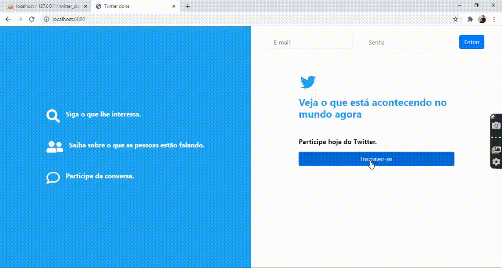

<h1>
    Projeto Twitter clone
</h1>
<h1>
    
</h1>

## 📄Sobre

O projeto Twitter clone foi desenvolvido dentro de um curso com o intuíto de exercitar os conteúdos estudados.

O projeto é um clone do Twitter com todas as funcionalidades incluídas, como registrar-se, logar, seguir e deixar de seguir amigos, postar, excluir postagens e logoff.

Nesse projeto, desenvolvi uma estrutura MVC com POO em PHP e banco de dados MySql e tive uma experiência que agregou muito valor aos meus conhecimentos e minhas técnicas de programação. Foi realmente muito divertido e gratificante desenvolver este projeto.

## 🚀Tecnologias utilizadas

As seguintes tecnologias foram utilizadas no projeto:

- HTML e CSS
- Bootstrap
- Jquery
- PHP

---
Desenvolvido por Carlos Gabriel Leite Barros.
